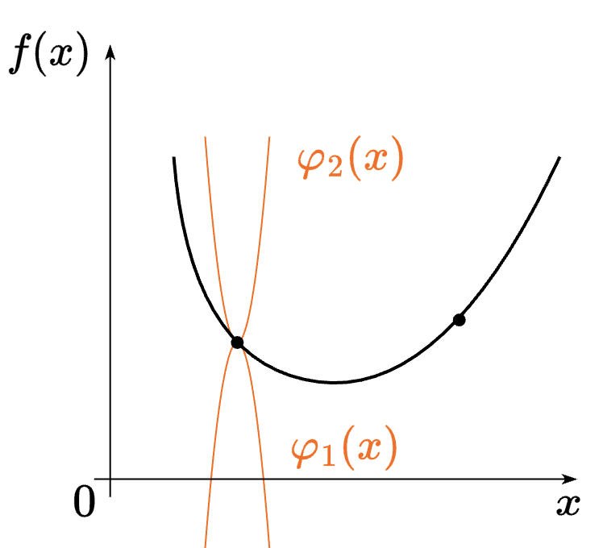
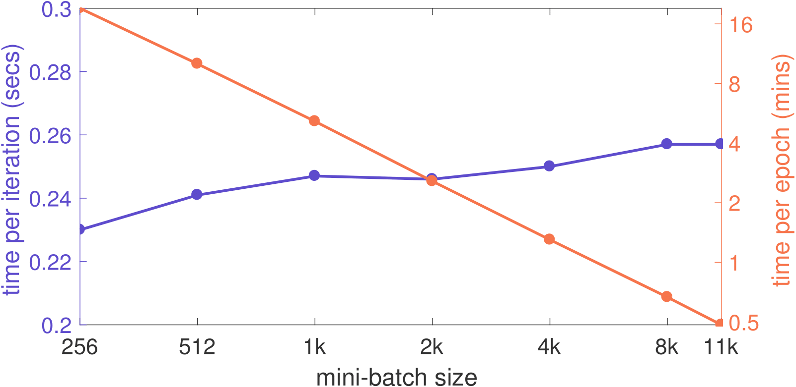
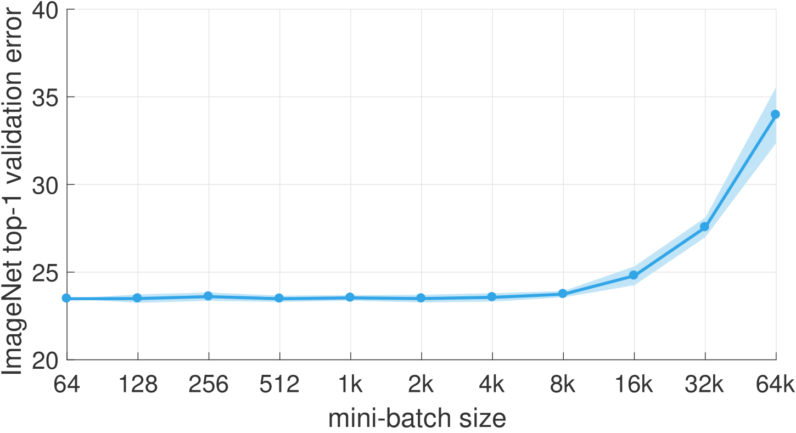

## 1. Показать, что направление антиградиента - направление наискорейшего локального убывания функции.

Пусть $f$ дифференцируема, зададим искомое направление локального убывания - $h$ - $\| h \| = 1$.
Тогда её апроксимация: $f(x + \alpha h) = f(x) + \alpha \langle \nabla f(x), h \rangle + o(\alpha)$
$f(x + \alpha h) < f(x) \mathbb{R}ightarrow \alpha  \langle \nabla f(x), h \rangle + o(\alpha) < 0$;
При $\alpha \rightarrow +0$ получаем: $\alpha \langle \nabla f(x), h \rangle \leqslant 0$

$\| \langle \nabla f(x), h \rangle \| \leqslant \| \nabla f(x) \| \| h \| \leqslant \| \nabla f(x) \|$

$\langle \nabla f(x), h \rangle \geq -\| \nabla f(x) \| \mathbb{R}ightarrow h = \dfrac{-\nabla f(x)}{\| \nabla f(x) \|}$, ч.т.д.

## 2.  Метод градиентного спуска.

Решаем задачу минимизации 

$$
f(x) \to \min_{x \in \mathbb{R}^d}
$$

Если $f$ дифференцируема, то тогда для решения этой задачи можно использовать метод градиентного спуска:

$$
x_{k + 1} = x_k - \alpha \nabla f(x_k)
$$

## 3.  Наискорейший спуск.

Решаем задачу минимизации 

$$
f(x) \to \min_{x \in \mathbb{R}^d}
$$

Если $f$ дифференцируема, то тогда для решения этой задачи можно использовать метод наискорейшего спуска:

$$
x_{k + 1} = x_k - \alpha_k \nabla f(x_k) \\
\alpha_k = \arg\min\limits_{\alpha \in \mathbb{R}^+} f(x_k - \alpha \nabla f(x_k)),
$$

т.е. выбираем наилучший шаг спуска на каждой итерации метода.

## 4. Липшицева парабола для гладкой функции.

Если $f: \mathbb{R}^n \rightarrow \mathbb{R}$ - непрерывно дифференцируема и градиент Липшицев с константой $L$, то $\forall x, y \in \mathbb{R}^n$:

$$
\| f(y) - f(x) - \langle \nabla f(x), y - x \rangle \| \leqslant \dfrac{L}{2}\| y - x \|^2
$$

Если зафиксируем $x_0 \in \mathbb{R}^n$, то:

$\varphi_1(x) = f(x_0) + \langle f(x_0), x - x_0 \rangle - \dfrac{L}{2}\| x - x_0 \|^2$

$\varphi_2(x) = f(x_0) + \langle f(x_0), x - x_0 \rangle + \dfrac{L}{2}\| x - x_0 \|^2$

Это две параболы, и для них верно, что $\varphi_1(x) \leqslant f(x) \leqslant \varphi_2(x)$ $\forall x$

## 5. Размер шага наискорейшего спуска для квадратичной функции.

Решаем задачу минимизации методом наискорейшего спуска

$$
f(x) = \dfrac{1}{2}x^TAx - b^Tx + с \to \min_{x \in \mathbb{R}^d} \\
\nabla f = \dfrac{1}{2}(A + A^T)x - b
$$

Из условия $\nabla f(x_{k + 1})^T \nabla f(x_k) = 0$ получаем:

$$
\alpha_k = \dfrac{2 \nabla f(x_k)^T \nabla f(x_k)}{\nabla f(x_k)^T (A + A^T) \nabla f(x_k)}.
$$

## 6. Характер сходимости градиентного спуска к локальному экстремуму для гладких невыпуклых функций в терминах $\mathcal{O}$ от числа итераций метода.

$$
\|\nabla f(x_k)\|^2 \approx \mathcal{O} \left( \dfrac{1}{k} \right).
$$

## 7. Характер сходимости градиентного спуска для гладких выпуклых функций в терминах $\mathcal{O}$ от числа итераций метода.

$$
f(x_k) - f^* \approx  \mathcal{O} \left( \dfrac{1}{k} \right).
$$

## 8. Характер сходимости градиентного спуска для гладких и сильно выпуклых функций в терминах $\mathcal{O}$ от числа итераций метода.

$$
\|x_k - x^*\|^2 \approx \mathcal{O} \left( \left(1 - \dfrac{\mu}{L}\right)^k \right),
$$

где $\mu$ - константа сильной выпуклости, $L$ - константа гладкости.

## 9. Связь спектра гессиана с константами сильной выпуклости и гладкости функции.

$$
\forall x \quad \mu = \lambda_{min}(\nabla^2 f(x)), \quad L = \lambda_{max}(\nabla^2 f(x)).
$$

## 10. Условие Поляка-Лоясиевича (градиентного доминирования) для функций.

$$
\exists \mu > 0: \quad \| \nabla f(x) \|^2 \geq 2\mu(f(x) - f^*) \forall x,
$$

где $f^*$ - минмимум функции $f(x)$.

## 11. Сходимость градиентного спуска для сильно выпуклых квадратичных функций. Оптимальные гиперпараметры.

Решаем задачу минимизации методом градиентного спуска

$$
f(x) = \dfrac{1}{2}x^TAx - b^Tx + с \to \min_{x \in \mathbb{R}^d}
$$

Пусть $A \in \mathbb{S}_{++} \mathbb{R}ightarrow \nabla f = Ax - b$

$$
x_{k + 1} = x_k - \alpha (Ax_k - b) \\
\alpha_{opt} = \dfrac{2}{\mu + L}, \text{ где } \mu = \lambda_{min}, L = \lambda_{max} \\
\kappa = \dfrac{L}{\mu} \geq 1 \\
\rho = \dfrac{\kappa - 1}{\kappa + 1} \\
\| x_k - x^* \| \leqslant \rho^k \| x_0 - x^* \|
$$

## 12. Связь PL-функций и сильно выпуклых функций.

Пусть $f$ $\mu$-сильно выпуклая и дифференицруемая $\mathbb{R}ightarrow f \in$ PL.

Обратное неверно - $f(x) = x^2 + 3\sin(x)^2 \in$ PL, но не сильно выпуклая (она вообще не выпуклая).

## 13. Привести пример выпуклой, но не сильно выпуклой задачи линейных наименьших квадратов (возможно, с регуляризацией).

Задача минимизации при прямоугольной матрице $A \in \mathbb{R}^{m\times n}, \ b\in \mathbb{R}^{m}$, $m < n$ (лежачая)
$$
\| A x - b \|^2 \to \min_{x \in \mathbb{R}^d}
$$

## 14. Пример сильно выпуклой задачи линейных наименьших квадратов (возможно, с регуляризацией)

Рассмотрим задачу минимизации функции:
$$f(\mathbf{x}) = \|A\mathbf{x} - \mathbf{b}\|^2 + \lambda \|\mathbf{x}\|^2$$
где $A$ — матрица размером $m \times n$ (ранг $A = n$), $\lambda > 0$. Эта функция сильно выпукла, так как гессиан положительно определен.

## 15. Пример выпуклой негладкой задачи линейных наименьших квадратов (возможно, с регуляризацией)

Рассмотрим задачу минимизации функции:
$$f(\mathbf{x}) = \|A\mathbf{x} - \mathbf{b}\|^2 + \lambda \|\mathbf{x}\|_1$$
где $A$ — матрица размером $m \times n$, $\lambda > 0$. Эта функция выпукла, но негладка из-за наличия $\ell_1$-регуляризации.

## 16. Субградиент. Субдифференциал.

Субградиент функции $f$ в точке $x$ — это вектор $g$, удовлетворяющий условию:

$$
f(y) \geq f(x) + g^T (y - x), \quad \forall y.
$$

Множество всех субградиентов в точке $x$ называется субдифференциалом и обозначается как $\partial f(x)$.

## 17. Субградиентный метод

Субградиентный метод используется для минимизации выпуклых функций, которые могут быть негладкими. Итерационная формула метода:

$$
x_{k+1} = x_k - \alpha_k g_k,
$$

где $g_k \in \partial f(x_k)$ — субградиент функции $f$ в точке $x_k$, $\alpha_k$ — шаг метода на $k$-й итерации.

## 18. Характер сходимости субградиентного метода для негладких выпуклых функций в терминах 𝒪 от числа итераций метода

Для негладких выпуклых функций субградиентный метод сходится со скоростью $\mathcal{O} \left(\frac{1}{\sqrt{k}}\right)$, где $k$ — число итераций.

## 19. Нижние оценки для гладкой выпуклой оптимизации с помощью методов первого порядка в терминах $\mathcal{O}$ от числа итераций метода.

выпуклая(не гладкая): $f(x^k) - f^* \sim  \mathcal{O}(\frac{1}{\sqrt{k}})$
гладкая(не выпуклая): $||\nabla f(x^k)||^2 \sim  \mathcal{O}(\frac{1}{k})$
 
гладкая и выпуклая: $f(x^k) - f^* \sim  \mathcal{O}(\frac{1}{k})$

гладкая и сильно-выпуклая(или PL):$||x^k - x^*||^2 \sim  \mathcal{O}\left((1 - \frac{\mu}{L})^k\right)$

## 20. Отличие ускоренной и неускоренной линейной сходимости для методов первого порядка.

| Тип | Неускоренная | Ускоренная |
| -------- | ------- | ------- |
 гладкая и сильно-выпуклая(или PL) |$\mathcal{O}\left((1 - \frac{\mu}{L})^k\right)$| $\mathcal{O}\left((1 - \sqrt{\frac{\mu}{L}})^k\right)$  |

## 21. Метод тяжелого шарика (Поляка).
Задача: $f(x) \rightarrow \min\limits_{x \in R^d}, \ f(x)$ - непрерывно дифференцируемая функция

$$
x_{k+1} = x_{k} −α∇f(x_{k}) + β(x_k−x_{k−1})
$$

## 22. Ускоренный градиентный метод Нестерова для выпуклых гладких функций.
Пусть $f : \mathbb{R}^n \rightarrow \mathbb{R}$ выпуклая и $L$-гладкая. Алгоритм Нестерова ускоренного градиентного спуска (NAG) предназначен для решения задачи минимизации, начиная с начальной точки $x_0 = y_0 \in \mathbb{R}^n$ и $\lambda_0 = 0$. Алгоритм повторяет следующие шаги:
$$
\begin{aligned}
&\textbf{Обновление градиента: } &y_{k+1} &= x_k - \frac{1}{L} \nabla f(x_k) \\
&\textbf{Экстраполяция: } &x_{k+1} &= (1 - \gamma_k)y_{k+1} + \gamma_k y_k \\
&\textbf{Экстраполяция веса: } &\lambda_{k+1} &= \frac{1 + \sqrt{1 + 4\lambda_k^2}}{2} \\
&\textbf{Экстраполяция веса: } &\gamma_k &= \frac{1 - \lambda_k}{\lambda_{k+1}}
\end{aligned}
$$
Метод сходится со скоростью $\mathcal{O}\left(\frac{1}{k^2}\right)$, а именно:
$$
f(y_k) - f^* \leq \frac{2L \|x_0 - x^*\|^2}{k^2}
$$

## 23. Ускоренный градиентный метод Нестерова для сильно выпуклых гладких функций.

Let $f : \mathbb{R}^n \rightarrow \mathbb{R}$ is $\mu$-сильно выпуклая and $L$-гладкая. Ускоренный градиентный метод (NAG) предназначен для решения задачи минимизации, начиная с начальной точки $x_0 = y_0 \in \mathbb{R}^n$ и $\lambda_0 = 0$. Алгоритм повторяет следующие шаги:
$$
\begin{aligned}
&\textbf{Обновление градиента: } &y_{k+1} &= x_k - \frac{1}{L} \nabla f(x_k) \\
&\textbf{Экстрополяция: } &x_{k+1} &= (1 - \gamma_k)y_{k+1} + \gamma_k y_k \\
&\textbf{Экстрополяция весов: } &\gamma_k &= \frac{\sqrt{L} - \sqrt{\mu}}{\sqrt{L} + \sqrt{\mu}}
\end{aligned}
$$
Метод сходится линейно, а именно:

$$
f(y_k) - f^* \leq \frac{\mu + L}{2}\|x_0 - x^*\|^2_2 \exp \left(-\frac{k}{\sqrt{\kappa}}\right)
$$

## 24. Проекция.
Проекция точки $y \in \mathbb{R}^n \text{ на множество } S \subseteq \mathbb{R}^n \text{ это точка }\text{proj}_S(y) \in S$:

$$
\text{proj}_S(y) = \arg \min\limits_{x \in S}\frac{1}{2}||x - y||^2_2
$$

## 25. Достаточное условие существования проекции точки на множество.
Если $S \subseteq \mathbb{R}^n -$ замкнутое множество, тогда проекция на множество $S$ существует для любой точки.

## 26. Достаточное условие единственности проекции точки на множество.
Если $S \subseteq \mathbb{R}^n -$ замкнутое выпуклое множество, тогда проекция на множество $S$ единствена для каждой точки.

## 27. Метод проекции градиента

Метод проекции градиента — это метод оптимизации с проекцией на бюджетное множество $S$:

$$
x_{k+1} = \text{proj}_S(x_{k} - \alpha_k \nabla f(x_{k})),
$$

где $\alpha_k$ — шаг градиента.

## 28. Критерий проекции точки на выпуклое множество (Неравенство Бурбаки-Чейни-Гольдштейна)

Проекция $\text{proj}_S(x)$ точки $x$ на выпуклое множество $S$ удовлетворяет:

$$
\langle x - \text{proj}_S(x), y - \text{proj}_S(x) \rangle \leq 0 \quad \forall y \in S.
$$

## 29. Проекция как нерастягивающий оператор

Проекция на выпуклое множество $S$ является нерастягивающим оператором:
$$\|\text{proj}_S(x) - \text{proj}_S(y)\| \leq \|x - y\| \quad \forall x, y.$$

## 30. Метод Франк-Вульфа

Метод Франк-Вульфа — это метод оптимизации для задач с выпуклыми ограничениями, включающий линейное приближение и линейное программирование:

$$
s_{k} = \arg \min_{s \in S} \langle \nabla f(x_{k}), s \rangle, \\
x_{k+1} = (1 - \gamma_k) x_{k} + \gamma_k s_{k},
$$

где $\gamma_k$ — шаг итерации.

## 31. Характер сходимости метода проекции градиента для гладких выпуклых функций в терминах $\mathcal{O}$ от числа итераций метода

Для гладких выпуклых функций метод проекции градиента имеет сходимость порядка $\mathcal{O}\left(\frac{1}{k}\right)$, где $k$ — число итераций.

## 32. Характер сходимости метода проекции градиента для гладких сильно выпуклых функций в терминах $\mathcal{O}$ от числа итераций метода

Для гладких сильно выпуклых функций метод проекции градиента имеет линейную сходимость порядка $\mathcal{O}\left(\log(\frac{1}{\varepsilon})\right)$, где $\varepsilon$ — точность решения.

## 33. Характер сходимости метода Франк-Вульфа для гладких выпуклых функций в терминах 𝒪 от числа итераций метода

Метод Франк-Вульфа для гладких выпуклых функций имеет сходимость порядка $\mathcal{O}\left(\frac{1}{k}\right)$, где $k$ — число итераций.

## 34. Характер сходимости метода Франк-Вульфа для гладких сильно выпуклых функций в терминах 𝒪 от числа итераций метода

Для гладких сильно выпуклых функций метод Франк-Вульфа имеет сходимость порядка $\mathcal{O}\left(\frac{1}{k^2}\right)$, где $k$ — число итераций.

## 35. 𝐴-сопряженность двух векторов. 𝐴-ортогональность. Скалярное произведение $\langle \cdot ,\cdot \rangle_A$.

$A$-сопряженность двух векторов $x$ и $y$ относительно симметричной положительно определённой матрицы $A$:
$$
\langle x, y \rangle _A = x^T A y.
$$

A-ортогональность:

$$
x \perp_A y \iff x^T A y = 0.
$$

## 74. Зачем увеличивать батч при обучении больших нейросетевых моделей. Warmup.

При наличии параллелизма время прохождения эпохи уменьшается.

Но если изменять только размер батча, то может сильно вырасти ошибка.

Эмпирическое правило: когда размер минибатча увеличился в $k$ раз, learning rate также необходимо увеличить в $k$ раз.

Warmup — это техника, применяемая к процессу обучения моделей, чтобы стабилизировать и улучшить обучение в ранних этапах. В процессе Warmup начальное значение скорости обучения постепенно увеличивается от низкого значения до целевого значения в течение нескольких первых эпох или шагов. Эта техника помогает избежать проблем, связанных с нестабильностью градиентов и резкими изменениями параметров модели в самом начале обучения.

## 75. Дифференциальное уравнение градиентного потока.

$$
\frac{dx}{dt} = \nabla f(x).
$$

## 76. Характер сходимости траектории градиентного потока для выпуклых функций в терминах $\mathcal{O}(t)$.

$$
f(x(t)) - f^* \leqslant \frac{1}{2t}\|x(0) - x^*\|^2 \quad \mathbb{R}ightarrow \quad \mathcal{O}\left(\frac{1}{t}\right).
$$

## 77. Характер сходимости траектории градиентного потока для PL-функций в терминах $\mathcal{O}(t)$.

$$
f(x(t)) - f^* \leqslant \exp\{-2\mu t\}(f(x(0)) - f^*) \quad \mathbb{R}ightarrow \quad \mathcal{O}\left(\exp\{-2\mu t\}\right).
$$

## 78. Дифференциальное уравнение Нестеровского ускоренного градиентного потока.

$$
    \ddot{X}(t) + \frac{3}{t}\dot{X}(t) + \nabla f(X(t)) = 0.
$$

## 79. Метод двойственного градиентного подъема.

Рассматривается задача: $f(x) \rightarrow \min\limits_{Ax = b}$. Двойственная задача: $-f^*(-A^Tu) - b^Tu \rightarrow \max\limits_{u}$, где $f^*(y) = \max\limits_{x}\left[y^T x - f(x)\right]$ - сопряженная функция. Определим $g(u) = -f^*(-A^Tu) - b^Tu$, тогда $\partial g(u) = A\partial f^*(-A^Tu) - b$. Перепишем это в виде $\partial g(u) = Ax - b$, где $x \in \arg \min\limits_{z}\left[f(z) + u^TAz\right]$. Тогда определим метод двойственного градиентного подъема:

$$
x_k \in \arg \min\limits_{x}\left[f(x) + (u_{k-1})^TAx\right] \\
u_k = u_{k-1} + \alpha_k(Ax_k - b).
$$

## 80. Связь константы сильной выпуклости $f$ и гладкости $f^*$.

Пусть $f$ - замкнутая и выпуклая. Тогда $f$ - сильно выпуклая с константой выпуклости $\mu \Leftrightarrow \nabla f^*$ - липшицев с параметром $\frac{1}{\mu}$.

## 81. Идея dual decomposition.

Рассматриваем задачу $\sum\limits_{i=1}^Bf_i(x_i) \rightarrow \min\limits_{Ax = b}$. Здесь $x = (x_1, \ldots, x_B)^T \in \mathbb{R}^n$ разделены на $B$ блоков переменных, каждый $x_i \in \mathbb{R}^{n_i}$. Разделим аналогично матрицу $A$: $A = \left[A_1, \ldots, A_B\right]$, где $A_i \in \mathbb{R}^{m\times n_i}$. Тогда

$$
x^{\text{new}} \in \arg\min\limits_{x}\left(\sum_{i=1}^B f_i(x_i) + u^TAx\right) \mathbb{R}ightarrow x^{\text{new}}_i \in \arg\min\limits_{x_i}\left(f_i(x_i) + u^TA_ix_i\right), \quad i = \overline{1,B}
$$

Тогда метод двойственного подъема запишется следующим образом:

$$
x^{k}_i \in \arg\min\limits_{x_i}\left(f_i(x_i) + u^TA_ix_i\right), \quad i = \overline{1,B} \\
u^k = u^{k-1} + \alpha_k\left(\sum_{i=1}^B A_ix_i^k - b\right).
$$

## 82. Метод двойственного градиентного подъема для линейных ограничений-неравенств.

Рассматриваем задачу $\sum\limits_{i=1}^Bf_i(x_i) \rightarrow \min\limits_{\sum\limits_{i=1}^BA_ix_i \leqslant b}$.

$$
x_i^k \in \arg \min\limits_{x_i}\left[f_i(x_i) + (u^{k-1})^TA_ix_i\right], \quad i = \overline{1,B} \\
u^k = \bigg(u^{k-1} + \alpha_k\left[\sum\limits_{i=1}^BA_ix_i^k - b\right]\bigg)_+,
$$

где $(u)_+$ обозначает $(u_+)_i = \max\{0, u_i\}$, $i=\overline{0,m}$.

## 83. Метод модифицированной функции Лагранжа.

Рассматриваем задачу $f(x) + \frac{\rho}{2}\|Ax - b\|^2 \rightarrow \min\limits_{Ax = b}$, где $\rho > 0$ - параметр. Тогда метод двойственного градиентного подъема имеет вид:

$$
x_k = \arg \min\limits_{x}\left[f(x) + (u_{k-1})^TAx + \frac{\rho}{2}\|Ax - b\|^2\right] \\
u_k = u_{k-1} + \rho(Ax_k - b).
$$

В этом случае имеет место следующее:

$$
L = f(x) + u^T(Ax - b) + \frac{\rho}{2}\|Ax - b\|^2 \\
x_k = \arg \min\limits_{x}\left[f(x) + (u_{k-1})^TAx + \frac{\rho}{2}\|Ax - b\|^2\right] \mathbb{R}ightarrow 0 \in \partial f(x_k) + A^T(u_{k-1} + \rho(Ax_k - b)) \mathbb{R}ightarrow 0 \in \partial f(x_k) + A^Tu_k.
$$

## 84. Метод ADMM.

Рассматриваем задачу $f(x) + g(z) \rightarrow \min\limits_{Ax + Bz = c}$. После добавления штрафа за выход из бюджетного множества имеем $f(x) + g(z) + \|Ax + bz - c\|^2 \rightarrow \min\limits_{Ax + Bz = c}$, где $\rho > 0$ - параметр. Тогда функция Лагранжа имеет вид:

$$
L_\rho(x, z, u) = f(x) + g(z) + u^T(Ax + Bz - c) + \frac{\rho}{2}\|Ax + Bz - c\|^2.
$$

И шаг ADMM записывается как:

$$
x_k = \arg\min\limits_{x}L_\rho(x, z_{k-1}, u_{k-1}) \\
z_k = \arg\min\limits_{z}L_{\rho}(x_k, z, u_{k-1}) \\
u_k = u_{k-1} + \rho(Ax_k + Bz_k - c).
$$

## 85. Формулировка задачи линейных наименьших квадратов с $\mathcal{l}_1$ регуляризацией в форме ADMM.

Пусть имееются $b\in \mathbb{R}^n, A \in \mathbb{R}^{n\times p}$ и рассматривается задача lasso: $\frac{1}{2}\|Ax - b\|^2_2 + \lambda \|x\|_1$. Преобразуем проблему к ADMM виду: $\frac{1}{2}\|Ax - b\|_2^2 + \lambda\|z\|_1 \rightarrow \min\limits_{x - z = 0}$.

## 86. Формулировка задачи поиска точки на пересечении двух выпуклых множеств в форме ADMM.

Пусть имеются выпуклые множества $U, V \subseteq \mathbb{R}^n$. Рассматриваем задачу $\mathbb{I}_U(x) + \mathbb{I}_V(x) \rightarrow \min\limits_{x}$. Преобразуем проблему к ADMM виду: $\mathbb{I}_U(x) + \mathbb{I}_V(z) \rightarrow \min\limits_{x - z = 0}$

## 13. Теорема о сходимости проксимального градиентного для сильно выпуклой гладкой функции $f$.

## Формулировка:
Рассматривается проксимальный метод

$$
x_{k+1} = \text{prox}_{\alpha r}(x_k - \alpha\nabla f(x_k)).
$$

Пусть $\varphi(x) = f(x) + r(x)$, причем

- $f$ - $\mu$-сильно выпуклая, дифференциируемая, с областью определения $\text{dom} f = \mathbb{R}^n$ и $\nabla f$ - $L$-Липшицев
- $r$ - выпуклая и $\text{prox}_{\alpha r}(x_k) = \arg \min\limits_{x \in \mathbb{R}^n}\left[\alpha r(x) + \frac{1}{2}\|x - x_k\|^2\right]$ может быть вычислен

Тогда проксимальный градиентный спуск с фиксированным шагом $\alpha \leqslant \frac{1}{L}$ сходится линейно, то есть имеет место

$$
\|x_{k+1} - x^*\|_2^2 \leqslant (1 - \alpha\mu)^k\|x_0-x^*\|_2^2
$$

### Доказательство:

$$
\|x_{k+1} - x^*\|^2_2 = \|\text{prox}_{\alpha f} (x_k - \alpha \nabla f (x_k)) - x^*\|^2_2 \overset{1}{=} \|\text{prox}_{\alpha f} (x_k - \alpha \nabla f (x_k)) - \text{prox}_{\alpha f} (x^* - \alpha \nabla f (x^*)) \|^2_2 \overset{2}{\leqslant} \\ \overset{2}{\leqslant} \|x_k - \alpha \nabla f (x_k) - x^* + \alpha \nabla f (x^*) \|^2_2 = \|x_k - x^*\|^2 - 2\alpha \langle \nabla f(x_k) - \nabla f(x^*), x_k - x^* \rangle + \alpha^2 \|\nabla f(x_k) - \nabla f(x^*)\|^2_2
$$

Воспользуемся $L$-гладкостью и сильной выпуклостью

$$
\|\nabla f(x_k)-\nabla f (x^*)\|_2^2 \leqslant 2L\left(f(x_k)-f(x^*)-\langle\nabla f (x^*),x_k -x^*\rangle \right) \ {}^3 \\
- \langle \nabla f(x_k) -  \nabla f(x^*), x_k - x^* \rangle \leqslant - \left(f(x_k) - f(x^*) + \frac{\mu}{2} \| x_k - x^* \|^2_2 \right) - \langle \nabla f(x^*), x_k - x^* \rangle
$$

Подставляем

$$
\|x_{k+1} - x^*\|^2_2 \leqslant \|x_k - x^*\|^2 - 2\alpha \left(f(x_k) - f(x^*) + \frac{\mu}{2} \| x_k - x^* \|^2_2 \right) - 2\alpha \langle \nabla f(x^*), x_k - x^* \rangle + \alpha^2 2L\left(f(x_k)-f(x^*)-\langle\nabla f (x^*),x_k -x^*\rangle \right) \leqslant \\
\leqslant (1 - \alpha \mu)\|x_k - x^*\|^2 + 2\alpha (\alpha L - 1) \left( f(x_k) - f(x^*) - \langle \nabla f(x^*), x_k - x^* \rangle \right)
$$

Так как $f$ выпуклая: $f(x_k) - f(x^*) - \langle \nabla f(x^*), x_k - x^* \rangle \geqslant 0$ и при $\alpha \leqslant \frac{1}{L}$:

$$
\|x_{k+1} - x^*\|^2_2 \leqslant (1 - \alpha \mu)\|x_k - x^*\|^2,
$$

Что и является линейной сходимостью с параметром $1 - \frac{\mu}{L}$.

0. Пусть $r : \mathbb{R}^n \rightarrow \mathbb{R} \cup \{+\infty\}$ выпуклая функция, для которой определен $\text{prox}_r$. Тогда $\forall x, y \in \mathbb{R}^n$, следующие условия эквивалентны:

    - $\text{prox}_r(x) = y$,
    - $x - y \in \partial r(y)$,
    - $\langle x - y, z - y \rangle \leqslant r(z) - r(y)$ for any $z \in \mathbb{R}^n$.

    **Доказательство.**

    $1\Leftrightarrow 2$. Первое условие может быть переписано в виде

    $$
    y = \arg \min_{\tilde{x} \in \mathbb{R}^d} \left( r(\tilde{x}) + \frac{1}{2} \| x - \tilde{x} \|^2 \right).
    $$

    Из условия оптимальности для выпуклой функции $r$, это эквивалентно:

    $$
    0 \in \left.\partial \left( r(\tilde{x}) + \frac{1}{2} \| x - \tilde{x} \|^2 \right)\right|_{\tilde{x} = y} = \partial r(y) + y - x \Leftrightarrow x - y \in \partial r(y).
    $$

    $2 \mathbb{R}ightarrow 3$. По определению субдифференциала, $\forall g \in \partial r(y), \ \forall z \in \mathbb{R}^d$:
    $$
    \langle g, z - y \rangle \leqslant r(z) - r(y).
    $$
    В частности, это верно для $g = x - y \mathbb{R}ightarrow \langle x - y, z - y \rangle \leqslant r(z) - r(y)$

    $3 \mathbb{R}ightarrow 2$. Пусть выполняется $\langle x - y, z - y \rangle \leqslant r(z) - r(y) \mathbb{R}ightarrow$ по определению субградиента $x - y \in \partial r(y)$.

1. Пусть $f: \mathbb{R}^n \rightarrow \mathbb{R} \cup \{+\infty\}$ и $r: \mathbb{R}^n \rightarrow \mathbb{R} \cup \{+\infty\}$ выпуклые функции. Пусть $f$ - $L$-гладкая, и для $r$ определен оператор $\text{prox}_r$. Тогда, $x^*$ - решение составной задачи оптимизации $\Leftrightarrow \forall \alpha > 0$, выполняется:

    $$
    x^* = \text{prox}_{r, \alpha}(x^* - \alpha \nabla f(x^*))
    $$

    **Доказательство.** Условия оптимальности:
    $$
    0 \in  \nabla f(x^*) + \partial r(x^*) \\ 
    - \alpha \nabla f(x^*) \in  \alpha \partial r(x^*) \\
    x^* - \alpha \nabla f(x^*) - x^* \in  \alpha \partial r(x^*)
    $$

    Воспользуемся пунктом 0: 
    $$
    \text{prox}_r(x) = y \Leftrightarrow x - y \in \partial r(y) \mathbb{R}ightarrow
    x^* = \text{prox}_{\alpha r}(x^* - \alpha \nabla f(x^*)) = \text{prox}_{r, \alpha}(x^* - \alpha \nabla f(x^*)).
    $$

2. Оператор $\text{prox}_{r}(x)$ - firmly nonexpansive, т. е.
    $$
    \|\text{prox}_{r}(x) -\text{prox}_{r}(y)\|_2^2 \leqslant \langle\text{prox}_{r}(x)-\text{prox}_{r}(y), x-y\rangle
    $$
    и nonexpansive:
    $$
    \|\text{prox}_{r}(x) -\text{prox}_{r}(y)\|_2 \leqslant \|x-y \|_2.
    $$

    **Доказательство.** Пусть $u = \text{prox}_r(x)$, and $v = \text{prox}_r(y)$. Тогда из пункта 0:
    $$
    \langle x - u, z_1 - u \rangle \leqslant r(z_1) - r(u) \\
    \langle y - v, z_2 - v \rangle \leqslant r(z_2) - r(v).
    $$

    Полагая $z_1 = v$ и $z_2 = u$ и суммируя, получаем:

    $$
    \langle x - u, v - u \rangle + \langle y - v, u - v \rangle \leqslant 0 \\
    \langle x - y, v - u \rangle + \|v - u\|^2_2 \leqslant 0 \\
    \|u -v\|_2^2 \leqslant \langle x - y, u - v \rangle \mathbb{R}ightarrow \|\text{prox}_{r}(x) -\text{prox}_{r}(y)\|_2^2 \leqslant \langle\text{prox}_{r}(x)-\text{prox}_{r}(y), x-y\rangle
    $$

    Применяя неравенство Коши-Буняковского:

    $$
    \|u -v\|_2^2 \leqslant \langle x - y, u - v \rangle \leqslant \|x - y\|\|u - v\| \mathbb{R}ightarrow \|u - v\| \leqslant \|x - y\| \mathbb{R}ightarrow \|\text{prox}_r(x) - \text{prox}_r(y)\|_2 \leqslant \|x - y\|
    $$

3. Пусть $f: \mathbb{R}^n \rightarrow \mathbb{R}$ - $L$-гладкая выпуклая функция. тогда $\forall x, y \in \mathbb{R}^n$, следующее неравенство сохраняются:

    $$
    f(x) + \langle \nabla f(x), y - x \rangle + \frac{1}{2L} \|\nabla f(x) - \nabla f(y)\|^2_2 \leqslant f(y) \Leftrightarrow \\
    \Leftrightarrow \|\nabla f(y)-\nabla f (x)\|_2^2 = \|\nabla f(x)-\nabla f (y)\|_2^2 \leqslant 2L\left(f(x)-f(y)-\langle\nabla f (y),x -y\rangle \right)
    $$

    **Доказательство.** Рассмотрим другую функцию $\varphi(y) = f(y) - \langle \nabla f(x), y\rangle$. Она, выпуклая как сумма выпуклых функций, а также $L$-гладкая, так как $\nabla \varphi(y) = \nabla f(y) - \nabla f(x)$ и $\|\nabla \varphi(y_1) - \nabla \varphi(y_2)\| = \|\nabla f(y_1) - \nabla f(y_2)\| \leqslant L\|y_1 - y_2\|$. То есть для $\varphi$ выполняется $\varphi(y) \leqslant  \varphi(x) + \langle \nabla \varphi(x), y-x \rangle + \frac{L}{2}\|y-x\|_2^2$.

    $$
    x := y, y := y - \frac{1}{L} \nabla\varphi(y) \quad \mathbb{R}ightarrow \quad \varphi\left(y - \frac1L \nabla\varphi(y)\right)  \leqslant \varphi(y) + \left\langle \nabla \varphi(y), - \frac1L \nabla\varphi(y)\right\rangle + \frac{1}{2L}\|\nabla\varphi(y)\|_2^2 \\
    \varphi\left(y - \frac1L \nabla\varphi(y)\right)  \leqslant \varphi(y) - \frac{1}{2L}\|\nabla\varphi(y)\|_2^2
    $$

    По дифференциальному критерию первого порядка, оптимальная точка для $\varphi$ определяется условием: $\nabla \varphi (y) =\nabla f(y) - \nabla f(x) = 0$. Поэтому $\forall x$, минимум функции $\varphi(y)$ находится в точке $y=x$. Тогда:
    $$
    \varphi(x) \leqslant \varphi\left(y - \frac1L \nabla\varphi(y)\right) \leqslant \varphi(y) - \frac{1}{2L}\|\nabla\varphi(y)\|_2^2
    $$

    Наконец, подставляем $\varphi(y) = f(y) - \langle \nabla f(x), y\rangle$:
    $$
    f(x) - \langle \nabla f(x), x\rangle \leqslant f(y) - \langle \nabla f(x), y\rangle - \frac{1}{2L}\|\nabla f(y) - \nabla f(x)\|_2^2 \\
    f(x) + \langle \nabla f(x), y - x \rangle + \frac{1}{2L} \|\nabla f(x) - \nabla f(y)\|^2_2 \leqslant f(y) \\
    \|\nabla f(y) - \nabla f(x)\|^2_2 \leqslant 2L \left( f(y) - f(x) - \langle \nabla f(x), y - x \rangle \right) \\
    \text{меняем местами x и y} \quad \mathbb{R}ightarrow \quad \|\nabla f(x)-\nabla f (y)\|_2^2 \leqslant 2L\left(f(x)-f(y)-\langle\nabla f (y),x -y\rangle \right)
    $$

## 14. Теорема о сходимости стохастического градиентного спуска в гладком PL-случае.

### Формулировка:
Рассмотрим задачу оптимизации $f(x(t)) \rightarrow \min\limits_{\substack{x(t) \in \mathbb{R}^d \\ t \in T}}$, функции $f(x)$ и $x(t)$ гладкие и $f$ - выпуклая, тогда градиентный поток сходится сублинейно со скоростью $\mathcal{O}\left(\frac{1}{n}\right)$, то есть выполняется $f(x(t)) - f^* \leqslant \frac{1}{2t}\|x(0) - x^*\|^2$.

### Доказательство:
Докажем **монотонность** сходимости.

$$
\frac{d}{dx}f(x(t)) = \nabla f(x(t))^T \underbrace{\dot{x}(t)}_{=\frac{dx(t)}{dt} = -\nabla f(x)} = -\| \nabla f(x(t)) \|_2^2 \leqslant 0.
$$

Если $f(x)$ - ограничена снизу, то $f(x(t))$ сходится как невозрастающая ограниченная снизу функция. Очевидно, что GF сходится к стационарной точке, в которой $\nabla f = 0$ (потенциально минимум, максимум или седловая точка).

Воспользуемся выпуклостью. По дифференциальному критерию 1-го порядка:

$$
f(x) \geqslant f(y) + \nabla f(y)^T(x - y) \quad \mathbb{R}ightarrow \quad \nabla f(y)^T(x - y) \leqslant f(x) - f(y) \\
\frac{d}{dt} \left[\|x(t) - x^*\|^2\right] = -2(x(t) - x^*)^T\nabla f(x(t)) = 2(x^* - x(t))^T\nabla f(x(y))\leqslant 2\left[f^* - f(x(t))\right] = -2\left[f(x(t)) - f^*\right] \mathbb{R}ightarrow \\
\mathbb{R}ightarrow f(x(t)) - f^* \leqslant -\frac{1}{2} \frac{d}{dt}\left[\|x(t) - x^*\|^2\right] \\
f(x(t)) - f^* \leqslant \frac{1}{t}\int\limits_{0}^t\left[f(x(s)) - f^*\right]ds \leqslant -\frac{1}{2t}\int\limits_{0}^t\frac{d}{ds}\left[\|x(s) - x^*\|^2\right]ds = -\frac{1}{2t}\|x(t) - x^*\|^2 + \frac{1}{2t}\|x(0) - x^*\|^2 \leqslant \frac{1}{2t}\|x(0) - x^*\|^2.
$$

## 15. Теорема сходимости траектории градиентного потока для выпуклых и PL-функций.

### Формулировка:
Рассмотрим задачу оптимизации $f(x(t)) \rightarrow \min\limits_{\substack{x(t) \in \mathbb{R}^d \\ t \in T}}$, функции $f(x)$ и $x(t)$ гладкие, $f$ - выпуклая и удовлетворяет условию PL, т.е. $\forall x \mapsto \|\nabla f(x)|^2 \geqslant 2\mu (f(x) - f^*)$, тогда градиентный поток сходится линейно, а именно, выполняется неравенство $f(x(t)) - f^* \leqslant \exp\{-2\mu t\}\left(f(x(0)) - f^*\right)$.

### Доказательство.
Предположим, у нас выполняется условие Поляка-Лоясевича $\|\nabla f(x)|^2 \geqslant 2\mu (f(x) - f^*)$, тогда

$$
\frac{d}{dt}\left(f(x(t)) - f(x^*)\right) = \nabla f(x(t))^T\underbrace{\dot{x}(t)}_{= \frac{dx}{dt} = -\nabla f(x)} = -\|\nabla f(x(t))|^2_2 \leqslant -2\mu \left(f(x(t)) - f^*\right)
$$

Интегрируя, получаем:

$$
f(x(t)) - f^* \leqslant \exp\{-2\mu t\}\left(f(x(0)) - f^*\right)
$$